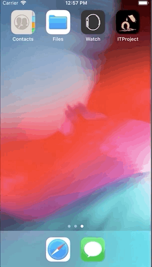
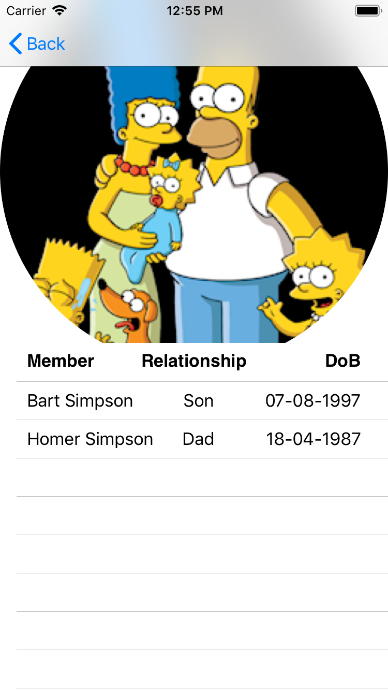
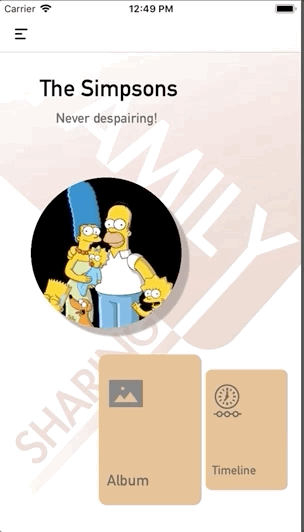

Liquid is a photo sharing IOS Smartphone App, which is the group project of ITProject, COMP30022, The University of Melbourne.

The app is specifically designed for family photo sharing.
***

<table border="0">
 

  
 

 <tr>
    <td></td>
    <td></td>
    <td></td>
    <td></td>
 </tr>
 <tr>
    <td></td>
    <td></td>
    <td></td>
    <td></td>

 </tr>
  <tr>
    <td></td>
 </tr>

</table>

## Key features
- User can join a family during registration to be in the family space, being able to watch and create media that shares their memories.
- Timeline to show the family memebers' activities to check out what is going on instant !!!
- Sharing your informations within the family, connecting memebers with each other.
- Comments, likes features on the medias, to share your thought and communicate with each other !!

## Usage
### Requirements
- Xcode 11
- iOS 12 for the system as we used new UI stroyboard.

### Step to Open : 
1. Run `pod install` in terminal, to install the required library.
To install [CocoaPods](http://www.cocoapods.org), run `sudo gem install cocoapods` in your console.
2. Open the project from, ITProject.xcworkspace. ,to have the libs 
3. Choose an Simulator (best for iPhone 6 as this is the client phone), can't put into the real device as we don't have lience to publish to app store.
4. Project should be up and running. 
you can create your own account or use the one that we used in the presentation.
Account: stella@qq.com, password: 123456789
    
### Unit Testing : 
1. simply just go to the testing folder, and click on the green diamond of the file to test the unit you want.
DONT FORGET TO ADD:  
 - DOCS ARE IN \DOCUMENTATION\ FOLDER 
 
